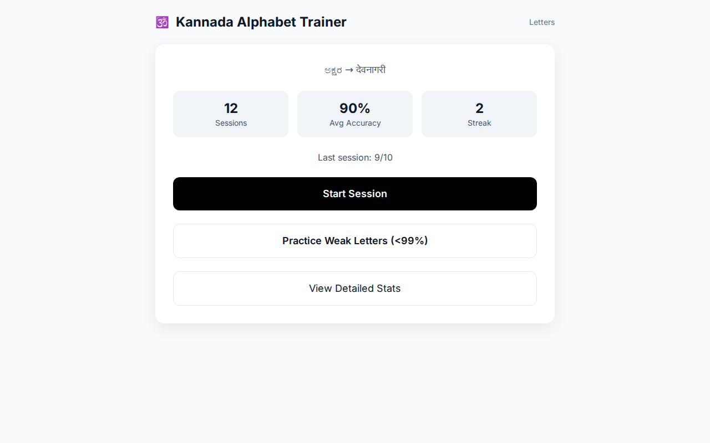
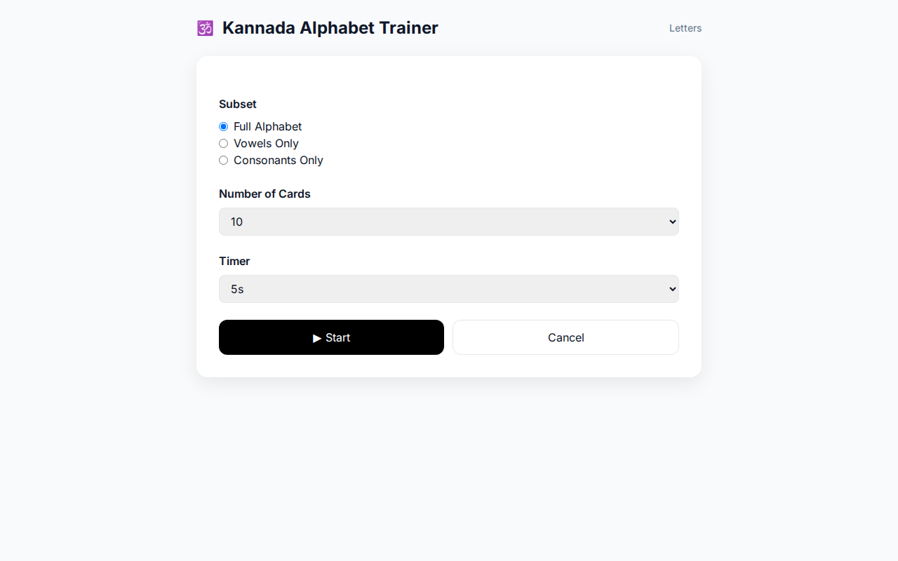
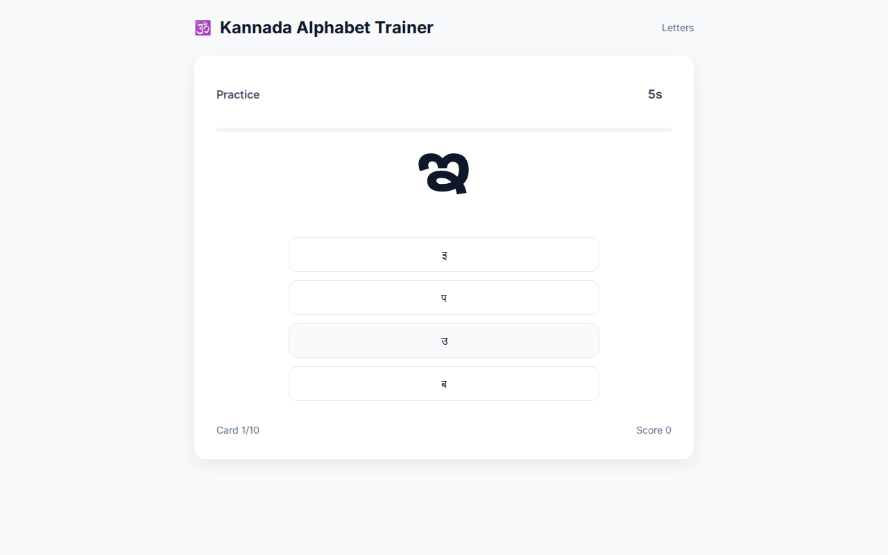

# Kannada Alphabet Trainer

A browser-based PWA for learning to recognise the Kannada alphabet, with Devanagari as the answer script. Built for personal practice toward reading fluency — newspapers, simple stories — rather than academic study.

## Table of Contents

- [Live App](#live-app)
- [Screenshots](#screenshots)
- [What it Covers](#what-it-covers)
- [Practice Modes](#practice-modes)
- [Features](#features)
- [Files](#files)
- [Deploy on GitHub Pages](#deploy-on-github-pages)
- [Local Use](#local-use)
- [Tech](#tech)
- [Companion App](#companion-app)

## Live app

[https://agpathak.github.io/Kannada_alphabet](https://agpathak.github.io/Kannada_alphabet)

## Screenshots

  
  
  

## What it covers

The full Kannada script: 15 vowels (ಸ್ವರ), 34 consonants (ವ್ಯಂಜನ) including conjuncts ಕ್ಷ and ಜ್ಞ, plus anusvara (ಅಂ) and visarga (ಅಃ). Each prompt shows a Kannada character; you pick the correct Devanagari equivalent from multiple-choice options.

Devanagari is used as the answer script rather than transliteration — a practical bridge for learners who already read Hindi or Marathi.

## Practice modes

| Mode | What it does |
|---|---|
| **Full Alphabet** | All vowels and consonants |
| **Vowels only** | Isolate the 15 vowels |
| **Consonants only** | Isolate the consonant groups |
| **Practice Weak Letters** | Cards below 99% accuracy (needs ≥ 8 attempts per card) |

Sessions are configurable: choose card count (5 / 10 / 20 / full set) and a countdown timer (off / 2s / 3s / 5s).

## Features

- **Progress Tracking:** Per-letter accuracy tracking persisted in `localStorage`.
- **Session History:** Track your scores and streaks over time.
- **Review System:** Wrong-letter review at the end of each session with a retry option.
- **Keyboard Shortcuts:** Use `1`, `2`, `3`, `4` on your keyboard to answer quickly.
- **PWA Support:** Installable as a Progressive Web App on iOS and Android.
- **Lightweight:** No server, no backend, no build step — just one HTML file.

## Files

- `index.html` — The entire app; all letter data and logic is embedded.
- `manifest.json` — PWA metadata.
- `screenshots/` — App screenshots for documentation.
- `icon-192.png`, `icon-512.png`, `apple-touch-icon.png` — App icons.

## Deploy on GitHub Pages

1. Create a new GitHub repository.
2. Upload all files to the repository root.
3. Go to **Settings → Pages**.
4. Under **Build and deployment**, set:
   - **Source:** `Deploy from a branch`
   - **Branch:** `main` (or `master`), folder `/ (root)`
5. Save — GitHub will provide a Pages URL within a minute or two.
6. **On iPhone:** Open the URL in Safari → Share → **Add to Home Screen**.
7. **On Android:** Open the URL in Chrome → Menu → **Install App**.

## Local use

Open `index.html` directly in any browser — no server needed. Progress is saved in `localStorage` and persists across sessions in the same browser but does not sync across devices.

## Tech

- **Plain HTML, CSS, and JavaScript**
- **Tailwind CSS** (via CDN) for styling
- **Noto Sans Kannada** (via Google Fonts) for script rendering
- **Hosted on GitHub Pages**

## Companion app

Once comfortable with the alphabet, move on to the [Kannada Matras Trainer](https://github.com/AGPATHAK/Kannada_matra) which covers consonant + vowel matra combinations (kagunita).
